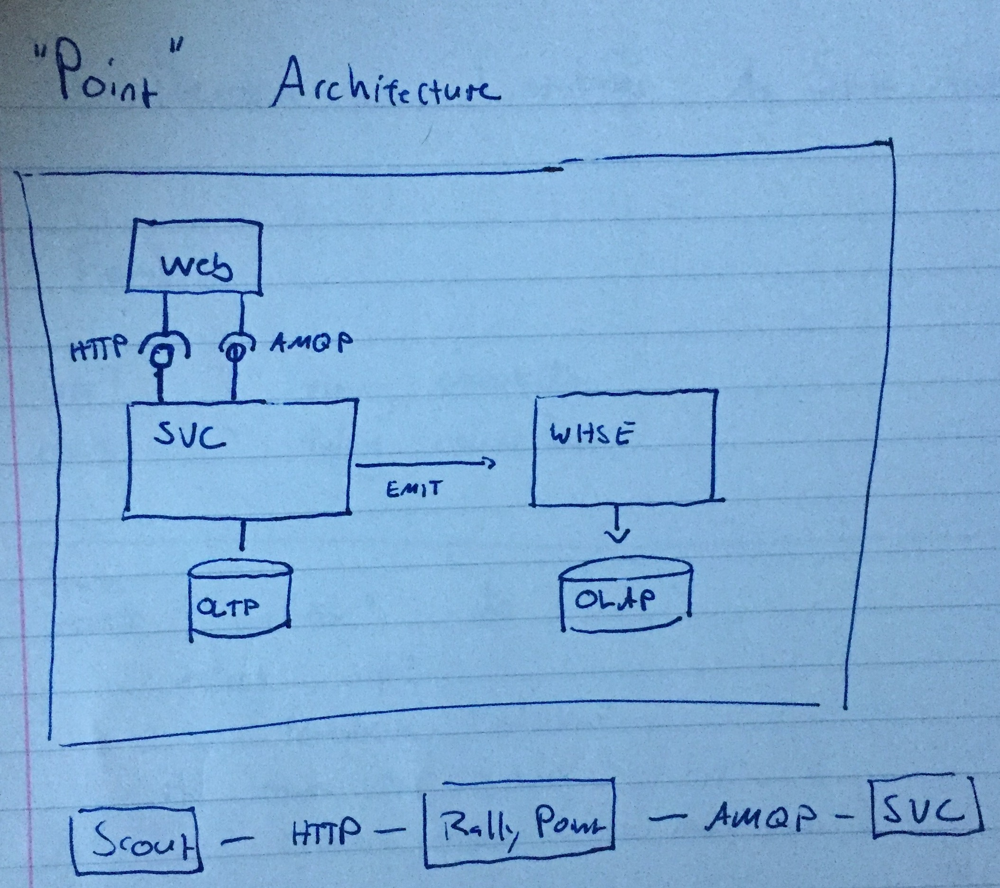

# Point Architecture

> a take on SOA Application Packaging

```text
<program> agent --ui 80 --port 5000
```

exposes a UI dashboard on port 80

```text
<program> agent --port 5000
```

Opens up port 5000 for HTTP work submission OLTP

May listen on a queue as well

Also starts an internal job engine

Stores data in a database

Exports events into a queue for OLAP work

```text
<program> analysis
```

## Run Control Loop

```text
<program> status
```

Output current status of RCL jobs



